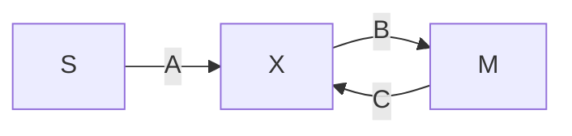

# Proof of Floyd's cycle detection algorithm for linked lists

S - starting point
X - intersection point
M - meeting point of fast and slow pointers

Assume Df be the distance travelled by fast pointer and Ds be the distance travelled by the slow pointer.

Let n be the number of rounds made by fast pointer

Df = A + n * (B + C) + B

Let m be the number of rounds made by slow pointer

Ds = A + m * (B + C) + B

As we know that the distance travelled by the fast pointer is twice the distance travelled by the slow pointer. So,

Df = 2 * Ds

A + n * (B + C) + B = 2 * (A + m * (B + C) + B)

A + nB + nC + B = 2A + 2mB + 2mC + 2B

nB + nC - 2mB - 2mC = A + B

n(B + C) - 2m(B + C) = A + B

(n - 2m) (B + C) = A + B

if consider (n - 2m) to be constant ≈ 1

then,

B + C = A + B

and

C = A

Hence, as we travel from start and meet point we meet at the point of intersection.
